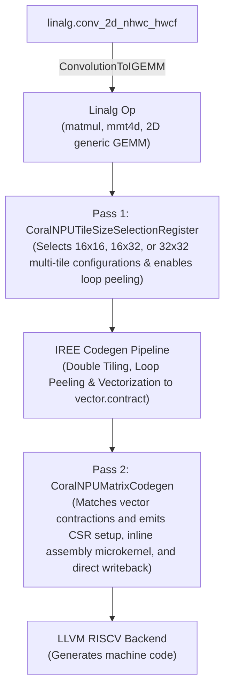

# CoralNPU Matrix Codegen Design & Implementation

This document describes the design and implementation of the direct codegen path in the CoralNPU compiler targeting the RISC-V **Zvt (Matrix)** extension.

## 1. Overview

The Zvt extension provides hardware-accelerated matrix multiplication operations on the CoralNPU. The goal of this codegen path is to lower matrix multiplication operations (`linalg.matmul` and `linalg.mmt4d`) and **convolutions (via implicit GEMM conversion)** directly to Zvt instructions when supported by the hardware, falling back to the standard vector (RVV / Zve) path otherwise.

The CoralNPU Zvt hardware systolic array features **16 processing elements (PEs)** that compute outer-product multiply-accumulate operations with dimensions $TM=16, TN=16, TK=1$. The extension provides 16 physical matrix registers (`mt0`–`mt15`). In 32-bit element mode (`EEW32`), each $16 \times 16$ tile accumulator is composed of four 4-PE subtiles, resulting in four independent 32-bit matrix accumulators: `mt0`, `mt4`, `mt8`, and `mt12`.

To eliminate systolic accumulator Read-After-Write (RAW) pipeline hazards and maximize memory bandwidth efficiency and data reuse, the compiler implements shape-aware **Multi-Tile Accumulation**:
*   **$2 \times 2$ Multi-Tile Grid** ($32 \times 32$ output block per iteration) utilizing all 4 independent 32-bit matrix accumulators (`mt0`, `mt4`, `mt8`, `mt12`), each updated once per K step, when both $M \ge 32$ and $N \ge 32$.
*   **$1 \times 2$ Multi-Tile Strip** ($16 \times 32$ output block) utilizing 2 accumulators (`mt0` and `mt4`) when $N \ge 32$ and $M < 32$.
*   **$1 \times 1$ Single-Tile** ($16 \times 16$ output block) utilizing `mt0`.

---

## 2. Compilation Pipeline

Targeting Zvt is designed as a streamlined pipeline integrated cleanly with IREE CPU codegen:



### 2.0. ConvolutionToIGEMM (Preprocessing)
`CoralNPUSession::extendPreprocessingPassPipeline` invokes IREE's `ConvolutionToIGEMMPass` (`createConvolutionToIGEMMPass`) with a CoralNPU affinity filter before partitioning, converting convolutions targeted for CoralNPU into an implicit GEMM format (`iree_linalg_ext.im2col` + a generic contraction op):
*   **Target-Aware**: Only converts convolutions whose `stream.affinity` targets a `coralnpu` device.
*   **Affinity Propagation**: The generated generic GEMM operation inherits the `coralnpu` `stream.affinity` attribute from the source convolution.
*   **GEMM Mapping**: Once unit batch dimensions are folded, the resulting 2D generic GEMM contraction is processed by the Zvt codegen pipeline (tiling, vectorization, and mapping to Zvt instructions).
*   **Fallback**: Convolutions without `coralnpu` affinity are left unconverted and lower via standard fallback paths.
*   **Current status**: a real compile names the device global `@__device_N`, which the symbol-name filter never matches, so convolutions still take the RVV fallback. Widening the filter needs a convolution allowlist first — depthwise and dilated convolutions produce `im2col` that fails to lower.

### 2.1. Pass 1: CoralNPUTileSizeSelectionRegister (Configuration & Loop Peeling)
This pass sets the `lowering_config` and `translation_info` on the root Linalg operation for the `CPUDoubleTilingExpert` pipeline:
*   **Contraction Detection**: Uses `isZvtMatrixContraction(op)` (gated by `hasZvtTargetFeature(op)`) to identify Zvt-compatible 2D contractions (`linalg.matmul`, transposed-operand matmuls, 2D `linalg.generic` contractions) and `linalg.mmt4d` operations across FP32 (FP32 $\times$ FP32 $\to$ FP32) and INT8 (INT8 $\times$ INT8 $\to$ INT32).
*   **Loop Dimension Order Alignment**: Correctly maps the innermost parallel loop (`loops[0] = N`) to the column dimension and the outer parallel loop (`loops[1] = M`) to the row dimension.
*   **Multi-Tile Register Selection**:
    *   When both $M \ge 32$ ($M \pmod{32} == 0$) and $N \ge 32$ ($N \pmod{32} == 0$), the pass configures **$2 \times 2$ Multi-Tile Tiling**: `mTile = 32, nTile = 32`.
    *   When the column dimension $N \ge 32$ and $N \pmod{32} == 0$ (and $M < 32$), the pass configures **$1 \times 2$ Multi-Tile Tiling**: `mTile = 16, nTile = 32`.
    *   Base fallback tile configuration: `mTile = 16`, `nTile = 16`.
*   **Unified Loop Peeling Configuration**: Embeds `enable_loop_peeling = true` in the `translation_info` configuration dictionary when the root op is a Zvt contraction, so a dimension that is not a multiple of the DTCM tile size (e.g. 96 tiled by 64) yields a static remainder subview instead of a masked `affine.min` slice, which cannot lower to fixed $16 \times 16$ Zvt ops. No extra intermediate pass is required.

### 2.2. Vectorization & Pre-LLVM Lowering Hook
This phase runs the standard IREE codegen pipeline:
*   **Double Tiling & Vectorization**: Lowers Linalg operations into 2D `vector.contract` operations (e.g., `vector<16x16xf32>`, `vector<16x32xf32>`, or `vector<16x32xi32>`).
*   **Pre-LLVM Lowering Hook (`beforeLowerToLLVMHook`)**: Before converting to LLVM dialect, `CoralNPUTargetBackend` invokes a callback that executes:
    1.  `CoralNPULimitLoopUnrollingPass`: Limits loop unrolling for large loops to avoid instruction cache overflow.
    2.  `DropVectorUnitDimsPass`: Folds unit vector dimensions.
    3.  `CoralNPUMatrixCodegenPass`: Transforms vector contractions directly into optimized Zvt matrix inline assembly microkernels.

### 2.3. Pass 2: CoralNPUMatrixCodegen (Unified Matrix Lowering)
This pass runs on MLIR `FunctionOpInterface` within `beforeLowerToLLVMHook` and converts vector contractions directly into hardware-optimized Zvt assembly:

> [!NOTE]
> **Why raw inline assembly rather than the `llvm.riscv.zvt.*` intrinsics.**
> 1. The tile configuration has to live in the same assembly block as the tile
>    operations it governs (step 2 below); with intrinsics, LLVM is free to place
>    a `vsetvli` in between, which would clear `mtype` and `vtype.altfmt`.
> 2. The K-loop is written as an assembly loop so its body and code size are
>    fixed by construction rather than left to the unroller — ITCM is small, and
>    a contraction-level lowering would expand per K step.
> 3. The register assignment (`t0`–`t6`, `v0/v4/v8/v12/v24`) is fixed, keeping the
>    tile-to-operand mapping identical across every emitted block.
>
> The cost is deliberate: the register allocator is shut out of the microkernel,
> and the `~{memory}` clobber on every block blocks scheduling and aliasing
> analysis across it. `llvm-project-0004-add-zvt-support.patch` also defines the
> full Zvt intrinsic and ISel surface; this pass does not use it today and it is
> kept for ISA completeness and eventual upstreaming. The *instruction*
> definitions in `RISCVInstrInfoZvt.td` are not optional — the inline assembler
> needs them to parse `vtmms.tvv`, `vtfmm.tvv`, `vtzero` and the `mset*` family.

1.  **Contraction Identification & Chain Analysis**:
    *   Gates the pass on `hasZvtTargetFeature(funcOp)` (`backend == "coralnpu"` and `+zvtbase`), then walks `vector.contract` operations and validates hardware constraints (`isSupportedMatrixContraction`).
    *   Identifies accumulator chains across `scf.for` / `scf.yield` loops or unrolled blocks writing back via `vector.transfer_write` or `vector.store`.
    *   Traces through type conversions and vector operations (`arith.extsi`, `arith.extui`, `arith.extf`, `vector.shape_cast`, `vector.broadcast`) to identify the source element precision (FP32 vs INT8).
    *   Detects input matrix layouts to determine whether Matrix A is contiguous/transposed ($K \times M$) or standard strided ($M \times K$).
2.  **Hardware CSR Configuration**:
    *   Every emitted assembly block opens with its own configuration preamble rather than relying on a single setup at function entry. This is mandatory: `vsetvli`/`vsetivli`/`vsetvl` clear `mtype` (`mtwiden`/`tk`/`tm`) and `vtype.altfmt` (see `RvvFrontEnd.sv`), and LLVM's vsetvli-insertion pass may place one between any two assembly blocks. Keeping the configuration in the same block as the tile operations it governs is the only way to make it safe.
    *   The preamble is `li t5, <mtype>; li t6, <vtype>; msetmtype t5, t6; li t6, 16; msettn zero, t6` (clobbering `t5`/`t6`):
        *   **FP32 Mode**: `msetmtype(16417, 18)` with $hwM=16, hwK=1, mtwiden=1$, and `vtype = 18` (`SEW=32, LMUL=4`).
        *   **INT8 Mode**: `msetmtype(16419, 256)` with $hwM=16, hwK=1, mtwiden=3$ (widening INT8 $\to$ INT32 accumulation), and `vtype = 256` (`SEW=8, LMUL=1`, `altfmt=1`). `altfmt` (bit 8) makes the *second* matmul operand signed; `vtmms.tvv` only encodes the first operand's signedness in the opcode, so without it the hardware computes signed $\times$ unsigned.
    *   Because `msetmtype` derives `LMUL`/`ta`/`ma` from `SEW` when `mtwiden != 0` (`SEW8` $\to$ `m1`, `SEW32` $\to$ `m4`) and programs `TM` and `TK` directly, it fully replaces a `vsetivli` + `msettm` pair. It zeroes `vl`, so `msettn` restores $TN=16$. No `vset*` instruction appears in any Zvt block.
    *   Blocks that clear or drain the accumulators use the FP32 configuration regardless of input type, since the accumulator tiles are always 32-bit; INT8 blocks then switch to the narrow configuration before the operand loads and multiplies.
3.  **Inline Fused Assembly Microkernels**:
    *   Emits an assembly loop with loop counter `t6` (`li t6, numKSteps; 1: ...; addi t6, t6, -1; bnez t6, 1b`), ensuring constant $O(1)$ code size fitting comfortably within ITCM.
    *   **$2 \times 2$ Multi-Tile Grid Accumulation ($32 \times 32$)**:
        *   Zeroes all 4 physical accumulators: `vtzero mt0`, `vtzero mt4`, `vtzero mt8`, and `vtzero mt12`.
        *   Loads LHS Tile 0 (`v4`) and LHS Tile 1 (`v24`).
        *   Loads RHS Tile 0 (`v8`) and RHS Tile 1 (`v12`).
        *   Dispatches 4-way interleaved systolic matrix multiplications with zero RAW stalls:
            *   Tile 0 (top-left, rows 0..15, cols 0..15): `vtfmm.tvv mt0, v4, v8` (FP32) / `vtmms.tvv mt0, v4, v8` (INT8).
            *   Tile 1 (top-right, rows 0..15, cols 16..31): `vtfmm.tvv mt4, v4, v12` (FP32) / `vtmms.tvv mt4, v4, v12` (INT8).
            *   Tile 2 (bottom-left, rows 16..31, cols 0..15): `vtfmm.tvv mt8, v24, v8` (FP32) / `vtmms.tvv mt8, v24, v8` (INT8).
            *   Tile 3 (bottom-right, rows 16..31, cols 16..31): `vtfmm.tvv mt12, v24, v12` (FP32) / `vtmms.tvv mt12, v24, v12` (INT8).
        *   Interleaving consecutive matrix operations across different accumulators completely eliminates systolic accumulator RAW hazards while reusing loaded LHS and RHS vector registers.
    *   **$1 \times 2$ Multi-Tile Strip Accumulation ($16 \times 32$)**:
        *   Zeroes accumulators: `vtzero mt0` and `vtzero mt4`.
        *   Loads the LHS row vector into `v4` once per $K$-step.
        *   Loads RHS Tile 0 into `v8` and RHS Tile 1 into `v12`.
        *   Dispatches dual systolic matrix multiplications:
            *   FP32: `vtfmm.tvv mt0, v4, v8` and `vtfmm.tvv mt4, v4, v12`.
            *   INT8: `vtmms.tvv mt0, v4, v8` and `vtmms.tvv mt4, v4, v12`.
        *   Alternating between `mt0` and `mt4` eliminates systolic RAW pipeline stalls.
    *   **Single-Tile Accumulation ($1 \times 1$, $16 \times 16$)**:
        *   Zeroes accumulator: `vtzero mt0`.
        *   Loads the LHS row vector into `v4` once per $K$-step.
        *   Loads RHS into `v8`.
        *   Dispatches single systolic operation: `vtfmm.tvv mt0, v4, v8` (FP32) or `vtmms.tvv mt0, v4, v8` (INT8).
    *   **Contiguous vs. Strided Vector Loads**:
        *   For transposed LHS ($K \times M$), loads are contiguous unit-stride (`vle32.v` for FP32; `vle8.v` for INT8).
        *   For standard LHS ($M \times K$), loads use strided vector loads (`vlse32.v` for FP32; `vlse8.v` for INT8).
4.  **Direct Pipelined Tile Writeback**:
    *   Extracts 32-bit rows from matrix accumulators using `vtmv.v.t` and stores them via `vse32.v` directly into Matrix C memory.
    *   `mt0` rows (top-left, rows 0..15, cols 0..15) are read with row index `t0` (`tss.tile = 0`).
    *   `mt4` rows (top-right, rows 0..15, cols 16..31) are read with tile index 4 via `lui t0, 0x20000` (`tss.tile = rs1[30:27]`).
    *   `mt8` rows (bottom-left, rows 16..31, cols 0..15) are read with tile index 8 via `lui t0, 0x40000`.
    *   `mt12` rows (bottom-right, rows 16..31, cols 16..31) are read with tile index 12 via `lui t0, 0x60000`.
5.  **Non-Fused Fallback**:
    *   When the chain cannot be fused into a single microkernel (no enclosing `scf.for`, non-constant trip count, an LHS/RHS operand whose base memref cannot be recovered, or an accumulator initializer that is neither zero nor the destination buffer), the contraction is lowered on its own: the LHS/RHS vectors stay as MLIR values passed through `^vr` inline-asm operands, and only the `vtfmm.tvv` / `vtmms.tvv` multiplies plus the tile writeback are emitted.
    *   The accumulators are still cleared with `vtzero` before the first multiply: inline for a standalone contraction, or once immediately before the loop for a K-reduction whose body was not fused. Without this the tiles would retain whatever a previous microkernel left behind.
6.  **Accumulator Assumption**:
    *   Because the tiles are always zeroed, the `acc` operand of the `vector.contract` is discarded. This matches the IREE-generated form, where the destination buffer is zero-filled before the matmul. A genuinely non-zero `acc` cannot be honoured, as no tile-load instruction is wired up.


### 2.4. LLVM RISCV Backend
The LLVM RISC-V backend supports the Zvt extension (`llvm-project-0004-add-zvt-support.patch`):
*   **Extension Features** (`RISCVFeatures.td`): `Zvtbase`, `Zvt8e`, `Zvt16e`, `Zvt64e`, `Zvti8i32mm`, `Zvtf8f32mm`, `Zvtf16f32mm`, `Zvtf32f32mm`. `CoralNPUTargetBackend` requests `+zvtbase,+zvt8e,+zvt16e,+zvti8i32mm,+zvtf32f32mm`.
*   **Instruction Registration** (`RISCVInstrInfoZvt.td`): encodings, pseudos and assembler support for `vtfmm.tvv`, `vtmms.tvv`, `vtmmu.tvv`, `vtzero`, `vtmv.v.t`, `msetmtype`, `msettm/tn/tk`, and the tile load/store family.
*   **VSETVLI Awareness** (`RISCVInsertVSETVLI.cpp`, `RISCVVSETVLIInfoAnalysis.cpp`): classifies Zvt operations so VL/VTYPE demands are computed correctly around them.
*   **Intrinsics \& ISel** (`IntrinsicsRISCVZvt.td`, `RISCVISelDAGToDAG.cpp`): the `llvm.riscv.zvt.*` surface, unused by this pass today (see the note in §2.3).

---

## 3. Supported Configurations

| Linalg Operation | Input Type | Accumulator Type | Extension | Target Instruction / Path | Status |
| :--- | :---: | :---: | :---: | :---: | :---: |
| `matmul`, `mmt4d` | **FP32** | **FP32** | `+zvtf32f32mm` | `vtfmm.tvv` (Zvt Hardware) | **Supported** |
| `matmul`, `mmt4d` | **INT8** | **INT32** | `+zvti8i32mm` | `vtmms.tvv` (Zvt Hardware) | **Supported** |
| `matmul`, `batch_matmul`, `mmt4d` | **INT16** | **INT32** | `+m,+f,+zvl128b,+zve32f` | RVV Vector Path / Fallback | **Supported** |
| `matmul`, `batch_matmul`, `mmt4d` | **INT32** | **INT32** | `+m,+f,+zvl128b,+zve32f` | RVV Vector Path / Fallback | **Supported** |
| `conv_2d_nhwc_hwcf` (via IGEMM) | **FP32** / **INT8** | **FP32** / **INT32** | `+zvtf32f32mm` / `+zvti8i32mm` | `vtfmm.tvv` / `vtmms.tvv` | **Not yet enabled** (see §2.0) |

### Fallback Behavior
Any operation that does not match hardware matrix constraints ($M \% 16 \ne 0$ or $N \% 16 \ne 0$) safely bypasses Zvt passes and compiles via IREE's standard RVV vector pipeline (`Zve32f` / `Zvl128b`).

---

## 4. Verification

### 4.1. Transform Unit Tests (MLIR Lit)
Unit tests for individual Zvt matrix compiler passes and lowerings are located in `tests/transforms/`:
*   `matrix_codegen.mlir`: Tests `CoralNPUMatrixCodegen` pattern matching, per-block CSR configuration (`msetmtype`, `msettn`), inline assembly microkernel generation (single-tile and multi-tile accumulation for both FP32 and INT8), and direct memory writeback. It also asserts the negative cases — a CoralNPU target without `+zvtbase`, a non-CoralNPU backend, and an unsupported tile shape must all be left untouched — and, via a second `FileCheck` prefix, that no `vset*` is emitted anywhere in the output.
*   `convolution_to_igemm.mlir`: Tests affinity-aware convolution to implicit GEMM (`im2col`) conversion in `ConvolutionToIGEMM`.

To run the transform test suite:
```bash
# Using Bazel:
bazel test --config=dev //tests/transforms/...

# Or using CMake / CTest:
ctest -L ci -R transforms
```

### 4.2. End-to-End Model & Operator Integration Tests
Integration tests covering StableHLO and Linalg models (matrix multiplications, batched matmuls, and 2D convolutions) execute compiled bytecode modules directly on the CoralNPU runtime simulator:
```bash
# Run all CI test targets:
# Using Bazel:
bazel test --config=dev --keep_going //tests:ci

# Or using CTest (with matching CI label):
ctest -L ci -j 64
```

### 4.3. Standalone Bare-Metal / RTL Simulation (AOT Harness)
The standalone AOT harness in `examples/matmul-aot-vme/` exports, compiles, and executes bare-metal VMFB modules across both **MPACT** (functional simulator) and **Verilator** (cycle-accurate RTL) simulators:

```bash
cd examples/matmul-aot-vme

# 1. Functional Simulation on MPACT (default):
# Run standard FP32:
./test_matmul.sh -n 32

# Run FP32 with transposed LHS:
./test_matmul.sh -n 32 --transpose-lhs

# Run INT8 with transposed LHS:
./test_matmul.sh -n 32 --int8 --transpose-lhs

# 2. Cycle-Accurate Hardware RTL Simulation on Verilator:
# Pass --use-verilator to run on Verilator:
./test_matmul.sh -n 32 --transpose-lhs --use-verilator

# 3. End-to-End linalg.mmt4d Verification (FP32 and INT8):
python3 test_mmt4d.py --bazel
```

#### Key Script Options
*   `--use-verilator`: Runs on the cycle-accurate Verilator RTL simulator instead of MPACT (default: `false`).
*   `-n`, `--size <N>`: Sets the square matrix dimension $N \times N$ (default: `128`).
*   `--transpose-lhs`: Exercises the contiguous unit-stride load path (`vle32.v` / `vle8.v`) for matrix $A^T B$.
*   `--int8`: Exercises INT8 $\times$ INT8 $\to$ INT32 matrix multiplication via `vtmms.tvv`.
