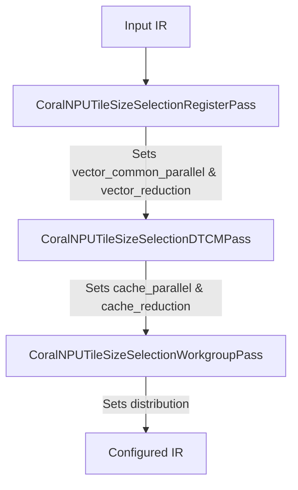
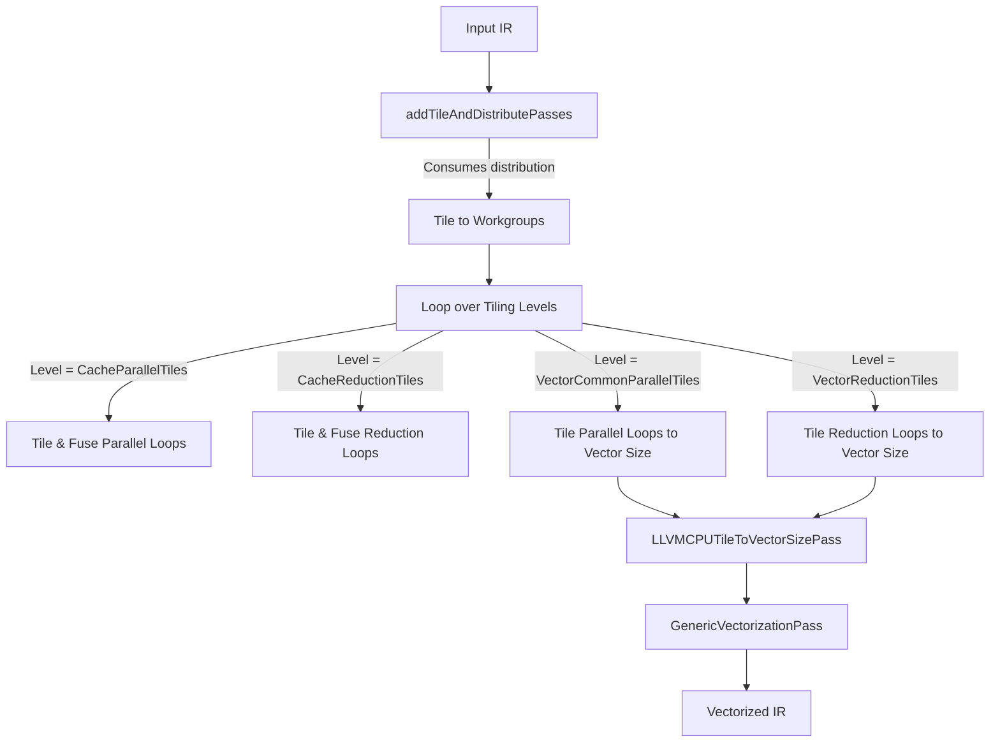

# CoralNPU Tiling Levels and Attributes (Based on IREE LLVMCPU) Explained

This document provides a detailed explanation of the tiling levels and attributes used in the IREE LLVMCPU target backend, which the Coral NPU backend extends.
It describes the purpose of each level, how they map to hardware, and where they are processed in the compiler pipeline.

The dynamic selection of these tile sizes is implemented in three cooperative passes in [CoralNPUTileSizeSelection.cpp](file:///usr/local/google/home/sflur/coralnpu/coralnpu-compiler/compiler/Transforms/CoralNPUTileSizeSelection.cpp):
- **`CoralNPUTileSizeSelectionRegisterPass`**: Computes register-level tile sizes.
- **`CoralNPUTileSizeSelectionDTCMPass`**: Computes DTCM-level tile sizes.
- **`CoralNPUTileSizeSelectionWorkgroupPass`**: Propagates DTCM-level tile sizes to the workgroup/distribution level.

These passes run sequentially during the configuration phase of the compiler pipeline, progressively building up and refining the `iree_codegen.compilation_info` attached to the root operation of each dispatch.


## Table of Contents
- [Multi-Level Tiling](#multi-level-tiling)
- [Auto-Computation of Alignments](#auto-computation-of-alignments)
- [Guided Tiling Example](#guided-tiling-example)

##  Multi-Level Tiling

IREE's `llvm-cpu` backend, which the CoralNPU relies on heavily, uses a structured approach where tiling is performed in three main logical levels, mapping to different layers of the hardware hierarchy:

```
[Problem Size] (DRAM)
      |
      |  <-- Level 0: Distribution (Workgroups)
      v
[Workgroup Tile] (SRAM / L2 Cache)
      |
      |  <-- Level 1: Cache (L1 Cache / DTCM)
      v
[Cache Tile] (Registers)
      |
      |  <-- Level 2: Vector (Registers)
      v
[Vector Tile] (Execution Units)
```

Each level is configured via the `iree_codegen.compilation_info` (specifically the [lowering_config](../../third_party/iree/compiler/src/iree/compiler/Codegen/Dialect/Codegen/IR/IREECodegenAttrs.td#L338) attribute) attached to the root operation of a dispatch.

The `LoweringConfigAttr` for CPU backends defines the following attributes (keys in the dictionary):

| Attribute Key | Enum Value ([TilingLevel](../../third_party/iree/compiler/src/iree/compiler/Codegen/Dialect/CPU/IR/IREECPUTypes.h#L18)) | Target Hardware | Loop Type | Purpose |
| :--- | :--- | :--- | :--- | :--- |
| `distribution` | `DistributionTiles` | Multiple Cores / Clusters | Parallel | Partitions work into independent Workgroups. |
| `cache_parallel` | `CacheParallelTiles` | L1/L2 Cache (or DTCM) | Parallel | Tiles parallel loops to fit in local memory. |
| `cache_reduction` | `CacheReductionTiles` | L1/L2 Cache (or DTCM) | Reduction | Tiles reduction loops to fit in local memory. |
| `vector_common_parallel` | `VectorCommonParallelTiles` | Registers / Vector Regs | Parallel | Tiles parallel loops to match vector register width. |
| `vector_reduction` | `VectorReductionTiles` | Registers / Vector Regs | Reduction | Tiles reduction loops to match vector register width. |
| `vector_inner_parallel` | `VectorInnerParallelTiles` | Registers / Vector Regs | Parallel | Tiles inner parallel loops (typically for pack/unpack). |

### 1. Level 0: Distribution (`DistributionTiles`)

*   **Configured by**: [CoralNPUTileSizeSelectionWorkgroupPass](file:///usr/local/google/home/sflur/coralnpu/coralnpu-compiler/compiler/Transforms/CoralNPUTileSizeSelection.cpp)
*   **Attribute Key**: `distribution`
*   **Purpose**: To partition the global iteration space of the operation into independent chunks called **Workgroups**. Each workgroup can be executed concurrently by different CPU cores or NPU clusters.
*   **Hardware Constraint**: Number of available compute cores/clusters.
*   **Optimization Goal**: Even workload distribution (load balancing) and alignment with Level 1 tiles.
*   **Factors**:
    *   **Core Count**: If the target has $C$ cores, we want the number of workgroups to be at least $C$.
    *   **Alignment**: The workgroup tile size must be a multiple of the Level 1 (DTCM) tile size. Typically, we set `DistributionTiles` equal to `CacheParallelTiles` so that each workgroup processes exactly one DTCM-sized tile, delegating the outer loop management to the runtime.
*   **Loop Types**: Only applies to **parallel loops**. Reduction loops cannot be distributed across workgroups without synchronization (which is avoided at this level).
*   **Example (Matmul 128x128x128)**:
    If `distribution = [8, 32, 0]`:
    *   The M-dimension (128) is tiled by 8.
    *   The N-dimension (128) is tiled by 32.
    *   This generates $\frac{128}{8} \times \frac{128}{32} = 16 \times 4 = 64$ workgroups.
    *   The K-reduction dimension is not tiled at this level (size 0).
*   **Lowering Pass**: Consumed by the pass [addTileAndDistributePasses](../../third_party/iree/compiler/src/iree/compiler/Codegen/LLVMCPU/Passes.cpp#L127) at the start of the codegen pipeline. It lowers the loops to `scf.forall` (or `scf.for` if distribution is disabled) which represents the workgroup grid.


### 2. Level 1: Cache (`CacheParallelTiles` & `CacheReductionTiles`)

This level is crucial for memory-constrained accelerators like the Coral NPU.

*   **Configured by**: [CoralNPUTileSizeSelectionDTCMPass](file:///usr/local/google/home/sflur/coralnpu/coralnpu-compiler/compiler/Transforms/CoralNPUTileSizeSelection.cpp)
*   **Purpose**: To tile the workgroup's iteration space so that the active data working set (inputs, weights, outputs) fits entirely within a specific level of the cache hierarchy (L1/L2 cache on standard CPUs) or the local SRAM (DTCM on the Coral NPU).
*   **Hardware Constraint**: Local memory size (DTCM / SRAM limit: e.g., 8KB to 32KB on Coral NPU).
*   **Optimization Goal**: Maximize data reuse in local memory and minimize slow DRAM accesses.
*   **Factors**:
    *   **DTCM Capacity**: The combined memory footprint of all tiled operands (inputs, weights, outputs) of the fused operation group must fit within the DTCM limit:
        $$\text{Footprint} = \left( \sum \text{Size}(\text{Tiled Inputs}) + \sum \text{Size}(\text{Tiled Outputs}) \right) \times \text{Bytes Per Element}$$
    *   **Fusion Boundary**: We must account for the footprint of elementwise producers and consumers that will be fused into the root operation.
    *   **Double Buffering Safety Margin**: If the runtime pipelines data transfers (DMA) with computation, we need to reserve space for the next tile's inputs while computing the current tile. This typically requires halving the effective DTCM capacity for tiling calculations (or using a 1.2x - 2.0x safety factor).
    *   **Vector Alignment**: DTCM tile sizes must be multiples of Level 2 (Vector) tile sizes to avoid generating clean-up loops (peeling) which increase code size and reduce efficiency.
*   **Attribute Keys**:
    *   `cache_parallel`: Tiles the parallel loops (e.g., M, N in Matmul).
    *   `cache_reduction`: Tiles the reduction loops (e.g., K in Matmul).
*   **Why split Parallel and Reduction?**
    *   Tiling parallel loops (`cache_parallel`) creates independent tiles that can be processed in any order. It is also where **producer-consumer fusion** happens (fusing elementwise operations).
    *   Tiling reduction loops (`cache_reduction`) is done to limit the footprint of the reduction dimension (e.g., K-dimension in matmul, or channels in conv). It requires accumulating intermediate results into a local buffer.
*   **Example (Matmul 128x128x128 inside a 8x32 workgroup)**:
    If `cache_parallel = [8, 32, 0]` and `cache_reduction = [0, 0, 128]`:
    *   Since the workgroup size is already 8x32, `cache_parallel` matching `8, 32` means no further parallel tiling is done (the whole workgroup is processed as one L1 tile).
    *   `cache_reduction = [0, 0, 128]` means the reduction loop K (128) is processed in chunks of 128 (meaning no reduction tiling is needed because 128 already fits in local memory).
*   **Lowering Passes**:
    Processed in the loop in [addMultiTilingExpertPassPipeline](../../third_party/iree/compiler/src/iree/compiler/Codegen/LLVMCPU/Passes.cpp#L225) (in [LLVMCPU/Passes.cpp](../../third_party/iree/compiler/src/iree/compiler/Codegen/LLVMCPU/Passes.cpp#L230)):
    *   `CacheParallelTiles` is lowered by `createLLVMCPUTileAndFuseProducerConsumerPass`.
    *   `CacheReductionTiles` is lowered by `createLLVMCPUTileRootAndFuseInputOperandsPass`.
    These passes generate `scf.for` loops.


### 3. Level 2: Vector (`VectorCommonParallelTiles` & `VectorReductionTiles`)

*   **Configured by**: [CoralNPUTileSizeSelectionRegisterPass](file:///usr/local/google/home/sflur/coralnpu/coralnpu-compiler/compiler/Transforms/CoralNPUTileSizeSelection.cpp)
*   **Purpose**: To tile the cache-level tiles down to sizes that can fit directly into the processor's registers (register file). This is the final tiling step before vectorization.
*   **Hardware Constraint**: Number of vector registers (e.g., 32 in RISC-V V extension) and vector register width (VLEN).
*   **Optimization Goal**: Maximize register reuse (register tiling) and ensure full utilization of SIMD execution units.
*   **Factors**:
    *   **Vector Width (VLEN)**: The tile size along the vectorized dimension should match or be a multiple of the number of elements that fit in a single vector register. E.g., for VLEN=128 bits:
        *   32-bit elements (float32, int32) $\rightarrow$ vector width = 4. Tile size should be a multiple of 4.
        *   8-bit elements (int8) $\rightarrow$ vector width = 16. Tile size should be a multiple of 16.
    *   **Register File Capacity**: For a matrix multiplication register tile of shape $M_{reg} \times N_{reg}$:
        *   We need $M_{reg} \times N_{reg}$ registers to accumulate the output.
        *   We need $M_{reg}$ registers to hold LHS vector cache.
        *   We need $N_{reg}$ registers to hold RHS vector cache.
        *   Total registers required: $(M_{reg} \times N_{reg}) + M_{reg} + N_{reg} \le \text{Available Vector Registers}$ (typically 32).
        *   Common configurations are $8 \times 4$ (32 accumulators, requires reusing registers or VLEN extensions) or $4 \times 4$ (16 accumulators, leaves 16 registers for LHS/RHS and temporary variables).
*   **Attribute Keys**:
    *   `vector_common_parallel`: Tiles the parallel loops.
    *   `vector_reduction`: Tiles the reduction loops.
*   **Goal**: The sizes selected here must match the target architecture's vector register width (e.g., 4 for float32 on RVV with 128-bit vectors).
*   **Example (Matmul 8x32 DTCM tile)**:
    If `vector_common_parallel = [8, 32, 0]` and `vector_reduction = [0, 0, 1]`:
    *   The parallel loops are tiled to 8 and 32. This matches the register unrolling strategy (e.g., a register tile of $8 \times 32$).
    *   The reduction loop is tiled to 1 (`vector_reduction = [0, 0, 1]`). This means we load 1 element along the K dimension at a time, multiply-accumulate it into the $8 \times 32$ accumulator registers.
*   **Lowering Passes**:
    *   Tiled by `createLLVMCPUTileAndFuseProducerConsumerPass` (for parallel) and `createLLVMCPUTileRootAndFuseInputOperandsPass` (for reduction) in the same loop in `Passes.cpp`.
    *   The resulting tiled loops are then vectorized by:
        *   [createLLVMCPUTileToVectorSizePass()](../../third_party/iree/compiler/src/iree/compiler/Codegen/LLVMCPU/Passes.cpp#L293): Ensures the loops are annotated or structured for vectorizer.
        *   [createGenericVectorizationPass()](../../third_party/iree/compiler/src/iree/compiler/Codegen/LLVMCPU/Passes.cpp#L298): Converts the `linalg` operations operating on these vector-sized tiles into MLIR `vector` dialect operations (like `vector.contract`, `vector.transfer_read/write`).
        *   Later, LLVM translates these MLIR vector ops to native CPU vector instructions (e.g., RVV `vfmacc.vv`).

### Summary of Configuration Pipeline

The following diagram shows how the three CoralNPU passes progressively configure the tiling attributes during the configuration phase:



### Summary of Lowering Pipeline Flow (CPUDoubleTilingExpert)

The following diagram shows where each tiling attribute is consumed in the `CPUDoubleTilingExpert` pipeline during the translation phase:



## Auto-Computation of Alignments

If the alignment options are set to `0` (default), the compiler automatically derives them from the auto-detected VLEN, the operation's element size, and the hardware register budget (`numVectorRegisters`, default 32):

1.  **Element Size**: Extracted from the output type of the root operation (e.g., 4 bytes for `i32`/`f32`, 1 byte for `i8`).
2.  **Vector Width** (elements):
    $$\text{Vector Width} = \frac{\text{VLEN}}{8 \times \text{Element Size Bytes}}$$
3.  **Alignments**:
    *   **Vector Alignment**:
        *   For operations with unroll loops (e.g., Matmul/Conv): Defaults to $\min(\text{Vector Width}, 8)$. Capping at 8 prevents exceeding the register file for large vector widths (like 32 for `i8`).
        *   For generic parallel operations: Defaults to `Generic Parallel Alignment`.
    *   **Unroll Alignment**: Defaults to `Vector Width` $\times U_{opt}$, where the optimal unroll factor $U_{opt}$ is dynamically computed to fit the register budget:
        *   It uses the register footprint formula for outer-product:
            $$\text{Registers} = 1 \text (LHS) + U \text (RHS) + \text{Vector Alignment} \times U \text (Accumulator)$$
        *   It solves for $U$ such that $\text{Registers} \le \text{numVectorRegisters}$ (default 32):
            $$U_{limit} = \max\left(1, \frac{\text{numVectorRegisters} - 1}{1 + \text{Vector Alignment}}\right)$$
        *   It also considers the actual size of the unroll loop ($OC$) to avoid over-aligning:
            $$U_{opt} = \min\left(U_{limit}, \lceil OC / \text{Vector Width} \rceil\right)$$
    *   **Reduction Alignment** = `1` (no alignment constraint on reduction loops by default).
    *   **Generic Parallel Alignment** = `Vector Width` (for generic parallel loops like elementwise).

### Example: VLEN=128 bits (from `+zvl128b`) and 32-bit integer elements (Matmul 128x128x128):
*   $\text{Vector Width} = \frac{128}{8 \times 4} = 4$ elements.
*   `Vector Alignment` = $\min(4, 8) = 4$.
*   $U_{limit} = \max(1, (32 - 1) / (1 + 4)) = 6$.
*   $U_{opt} = \min(6, 32) = 6$.
*   `Unroll Alignment` = $4 \times 6 = 24$.
*   `Generic Parallel Alignment` = 4.

### Example: VLEN=256 bits (from `+zvl256b`) and 32-bit integer elements (Matmul 128x128x128):
*   $\text{Vector Width} = \frac{256}{8 \times 4} = 8$ elements.
*   `Vector Alignment` = $\min(8, 8) = 8$.
*   $U_{limit} = \max(1, (32 - 1) / (1 + 8)) = 3$.
*   $U_{opt} = \min(3, 16) = 3$.
*   `Unroll Alignment` = $8 \times 3 = 24$.
*   `Generic Parallel Alignment` = 8.


## Guided Tiling Example

Below is a step-by-step walkthrough of how a large matrix multiplication is tiled by the compiler across all levels.

> [!NOTE] 
> This example is meant to show how an operation that targets RVV vectorization
> works. Matmul was chosen as it is relatively simple, and demonstrates most of
> the relevant details. In the near future, matmul will be targeting the MAC
> block, instead of the RVV, and it will have a slightly different handling. The
> example is still relevant for when the MAC is disabled, and it is a good
> explanation, even if not 100% accurate.

*   **Operation**: Matmul ($1024 \times 1024 \times 1024$) of 32-bit integer elements (`i32`).
*   **Hardware Target**: CoralNPU with 8 KB DTCM, 128-bit VLEN, and 32 vector registers.
*   **Vector Width**: $\frac{128}{8 \times 4} = 4$ elements.

### Step 1: Level 2: Vector (Register) Tiling
*   **Goal**: Fit active workload into the 32 vector registers and maximize register reuse.
*   **Vector Loops (M)**: Aligned to `Vector Alignment` $\rightarrow$ Tile size = 4.
*   **Unroll Loops (N)**: Aligned to `Unroll Alignment` (dynamically computed to 24 for UF=6) $\rightarrow$ Tile size = 24.
*   **Reduction Loops (K)**: Aligned to 1 (vector reduction) $\rightarrow$ Tile size = 1.
*   **Resulting Register Tile**: `[4, 24, 1]` (configured via `vector_common_parallel = [4, 24, 0]` and `vector_reduction = [0, 0, 1]`).
*   **Register Footprint**: $1 \text{ (LHS)} + 6 \text{ (RHS)} + 24 \text{ (Acc)} = 31$ vector registers ($\le 32$, fits!).

### Step 2: Level 1: Cache (DTCM) Tiling
*   **Goal**: Fit active tiles of LHS (M x K), RHS (K x N), and Out (M x N) in DTCM.
*   **Limit**: 8 KB DTCM / 1.2 safety factor = 6826 bytes.
*   **Process**:
    1.  **Initialize**: Start with static loop ranges: `[1024, 1024, 1024]`.
    2.  **Initial Alignments**: Align down to base alignments:
        *   M aligned to `Vector Alignment` (4) $\rightarrow 1024$.
        *   N aligned to `Unroll Alignment` (24) $\rightarrow 1008$ (since 1024 aligned down to 24 is 1008).
        *   K aligned to `Reduction Alignment` (1) $\rightarrow 1024$.
    3.  **Footprint Search**: The initial footprint is $(1024 \times 1008 \times 3) \times 4$ bytes $\approx 11.8$ MB (exceeds 8 KB). The compiler enters the shrink loop:
        *   **Shrink Parallel Loops (M, N)**: Shrunk by halving (dividing by 2 and aligning down) first, down to their alignment limits:
            *   M shrinks: $1024 \rightarrow 512 \rightarrow \dots \rightarrow 4$ (stops at `Vector Alignment` limit of 4).
            *   N shrinks: $1008 \rightarrow 504 \rightarrow \dots \rightarrow 24$ (stops at `Unroll Alignment` limit of 24).
            *   Current tile: `[4, 24, 1024]` (Footprint: $(4\times 1024 + 1024\times 24 + 4\times 24) \times 4 \approx 115$ KB, still exceeds 8 KB).
        *   **Shrink Reduction Loops (K)**: Shrunk next:
            *   K shrinks: $1024 \rightarrow 512 \rightarrow 256 \rightarrow 128 \rightarrow 64 \rightarrow 32$.
            *   At `[4, 24, 32]`, the footprint is:
                $$\text{LHS (4x32)} + \text{RHS (32x24)} + \text{Out (4x24)} = 128 + 768 + 96 = 992 \text{ elements} = 3968 \text{ bytes}$$
                $$3968 \text{ bytes} \times 1.2 = 4761.6 \text{ bytes} \le 8192 \text{ bytes (Fits!)}$$
*   **Resulting DTCM Tile**: `[4, 24, 32]` (configured via `cache_parallel` and `cache_reduction`).

#### Graceful Degradation (Alignment Fallback)

If the shrink loop reaches the alignment limits (e.g., `M` reaches 4 and `N` reaches 24) and the footprint *still* exceeds DTCM capacity, the compiler falls back to a finer granularity. It resets all loop alignments (Vector, Unroll, and Reduction) to `1` and attempts to shrink the tile sizes further (e.g., trying to fit `[2, 24, 32]`, `[1, 12, 16]`, etc.).

This degradation preserves memory correctness (avoiding DTCM overflow) but will result in scalar or less-efficient vector code because the tile sizes are no longer multiples of the register vector widths. If the workload cannot fit even with a `[1, 1, 1]` tile size, the pass emits an error and aborts compilation.


### Step 3: Applying Level 1 (Cache) Tiling
*   **Goal**: Map the computed DTCM tile sizes to `cache_parallel` and `cache_reduction` attributes.
*   **Resulting Attributes**:
    *   `cache_parallel` = `[4, 24, 0]` (tiling parallel loops M and N).
    *   `cache_reduction` = `[0, 0, 32]` (tiling reduction loop K).

### Step 4: Level 0: Distribution (Workgroup) Tiling
*   **Goal**: Distribute work across cores. We map it to DTCM tile sizes so each workgroup handles exactly one DTCM-sized tile (enabling DMA/Compute pipelining).
*   **Resulting Attribute**: `distribution = [4, 24, 0]`.

### Final Lowering Configuration
The compiler attaches the following compilation info to the `linalg.matmul` operation:
```mlir
#iree_codegen.compilation_info<
  lowering_config = #iree_cpu.lowering_config<
    cache_parallel = [4, 24, 0],
    cache_reduction = [0, 0, 32],
    distribution = [4, 24, 0],
    vector_common_parallel = [4, 24, 0],
    vector_reduction = [0, 0, 1]
  >,
  translation_info = <pipeline = CPUDoubleTilingExpert>
>
```
